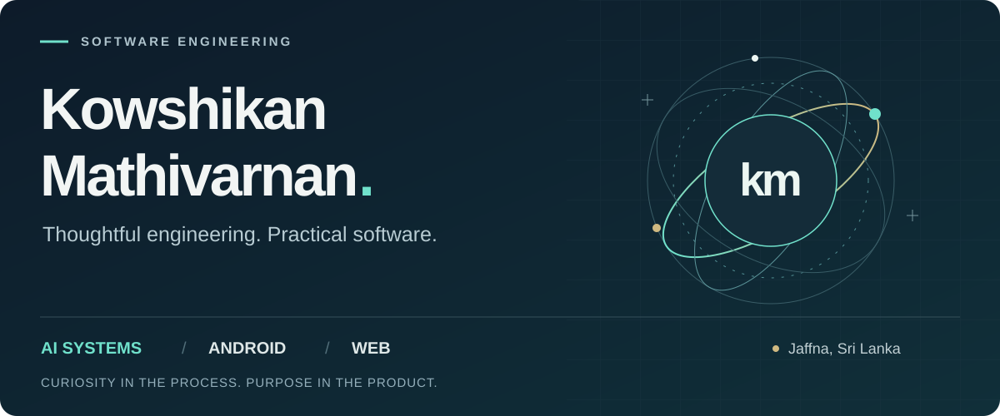
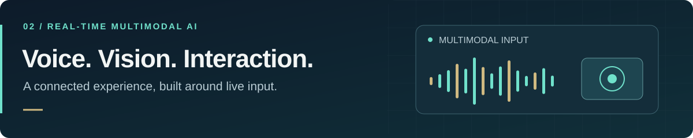
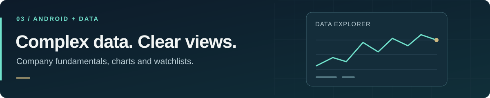
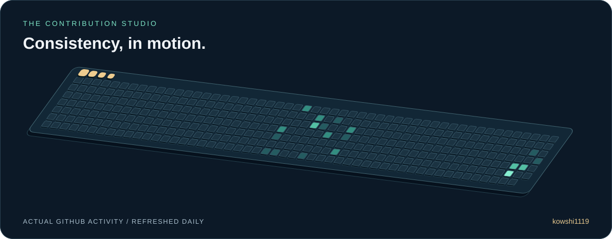

  <picture>
    <source media="(prefers-reduced-motion: reduce) and (max-width: 600px)" srcset="assets/profile-hero-mobile-static.svg" />
    <source media="(prefers-reduced-motion: reduce)" srcset="assets/profile-hero-static.svg" />
    <source media="(max-width: 600px)" srcset="assets/profile-hero-mobile.svg" />
    
  </picture>

  
  &nbsp;
  
  &nbsp;
  

# Building software for real-world workflows.

I'm **Kowshikan Mathivarnan**, a **Trainee Software Engineer at 10QBIT** and Computer Science undergraduate at the **University of Bedfordshire**. My projects span AI agents, Android applications and full-stack web development, with a growing focus on automated software quality.

Based in **Jaffna, Sri Lanka** · Tamil (native) · English (professional)

**Career interests:** Software engineering, applied AI and Android development. I enjoy turning practical problems into working applications and would welcome a conversation with teams building useful products.

**Explore:** [Selected work](#selected-work) · [Experience](#experience) · [Technical toolkit](#technical-toolkit) · [Contribution studio](#contribution-studio)

## At a glance

- **For hiring teams:** Trainee Software Engineer at 10QBIT, with internship and freelance experience, competition recognition and a Computer Science degree in progress.
- **For technical leaders:** Explore browser automation, multimodal AI integration and Android data architecture, with source code and project limitations documented.
- **For founders & business leaders:** My projects explore practical workflows in software quality, healthcare interaction and financial data access.

## Recognition

| Award | Achievement |
| :--- | :--- |
| **Q4US CodeArt Challenge · 2025** | **Winner · LKR 100,000** — creative coding and problem solving |
| **SLIIT Codefest ALGOTHAN · 2025** | **Merit Award** — algorithmic problem solving |
| **Google Gemini Live Agent Challenge** | Participant — MedVision multimodal AI project |

## Selected work

Three projects that show how I approach automation, AI integration and mobile development. Illustrations below represent each project's focus; they are not application screenshots.

### 01 / AutoQA

<a href="https://github.com/kowshi1119/multi-agent-autoqa"><picture><source media="(prefers-reduced-motion: reduce)" srcset="assets/project-autoqa-static.svg" /></picture></a>

**Making software defects easier to reproduce and investigate.** An autonomous QA prototype that explores web applications in Chromium, checks suspected failures with code-based rules, and replays findings in independent browser contexts before reporting them.

- **Engineering focus:** Bounded agent actions, browser automation and evidence-backed defect reporting.
- **Built with:** TypeScript · Playwright · Node.js · AI model integrations
- **Stage:** Prototype with local fixtures and benchmark tooling.

[Explore the code and architecture →](https://github.com/kowshi1119/multi-agent-autoqa)

### 02 / MedVision

<a href="https://github.com/kowshi1119/medvision-live-agent-Gemini_LiveAgent_Hackathon-"><picture><source media="(prefers-reduced-motion: reduce)" srcset="assets/project-medvision-static.svg" /></picture></a>

**Exploring real-time voice and vision in a single AI interface.** A Gemini Live Agent Challenge project combining bidirectional audio, live camera input and structured triage-card output in an emergency-response concept.

- **Engineering focus:** Streaming interaction, multimodal integration and a React interface backed by Python services.
- **Built with:** Python · FastAPI · React · TypeScript · Gemini Live API · Google Cloud
- **Stage:** Hackathon project; an exploration of medical AI interaction, not a clinically validated product.

[Explore the code and technical walkthrough →](https://github.com/kowshi1119/medvision-live-agent-Gemini_LiveAgent_Hackathon-)

### 03 / CSE Stock Insight

<a href="https://github.com/kowshi1119/CSESTOCKINSIGHT"><picture><source media="(prefers-reduced-motion: reduce)" srcset="assets/project-cse-static.svg" /></picture></a>

**Bringing company data and financial charts into an Android experience.** An educational application for exploring Colombo Stock Exchange fundamentals, price history and watchlists, with local persistence and background data operations.

- **Engineering focus:** Android UI, repository-based data access, interactive charts and Room storage.
- **Built with:** Java · Android SDK · Room / SQLite · Retrofit · MPAndroidChart
- **Stage:** Educational project with sample data; live API integration remains future work.

[Explore the Android project →](https://github.com/kowshi1119/CSESTOCKINSIGHT)

**More work:** [SmartNotes — offline-first Android notes](https://github.com/kowshi1119/SmartNotes-Android-Notes-App) · [AI Hospital Receptionist](https://github.com/kowshi1119/AI-Hospital-Receptionist) · [Portfolio website source](https://github.com/kowshi1119/kowshigan-portfolio)

## Contribution studio

A small visual signature, powered by my actual GitHub contribution history.

  <picture>
    <source media="(prefers-reduced-motion: reduce)" srcset="https://raw.githubusercontent.com/kowshi1119/kowshi1119/output/contribution-snake-static.svg" />
    <source srcset="https://raw.githubusercontent.com/kowshi1119/kowshi1119/output/contribution-snake.svg" />
    
  </picture>

[View contribution history →](https://github.com/kowshi1119?tab=overview) · [Animation workflow](https://github.com/kowshi1119/kowshi1119/actions/workflows/snake.yml)

## Experience

| Role | Organisation | Dates |
| :--- | :--- | :--- |
| **Trainee Software Engineer** | 10QBIT | Aug 2026 – Present |
| **Freelance Developer** | Independent | Feb 2026 – Aug 2026 |
| **Software Engineer Intern** | HABB | Oct 2025 – Mar 2026 |

## Technical toolkit

<picture>
  <source media="(prefers-reduced-motion: reduce)" srcset="assets/tech-stack-static.svg" />
  
</picture>

Technologies used across my projects and learning. The linked repositories show where and how I apply them.

| Area | Technologies & practices |
| :--- | :--- |
| **AI & automation** | Python, Gemini Live API, Playwright, agent workflows |
| **Mobile** | Java, Kotlin, Android SDK, Room, Retrofit, Kotlin Flow, MVVM |
| **Web & backend** | TypeScript, JavaScript, React, Node.js, Express, FastAPI |
| **Data & delivery** | MySQL, MongoDB, SQLite, Firebase, Docker, Git, GitHub, Google Cloud |

## Education

**BSc (Hons) Computer Science** 
University of Bedfordshire · 2026–2027

**Higher National Diploma in Information Technology** 
SLIIT City Uni · 2024–2026

Earlier education

J/Kokuvil Hindu College · 2007–2021 
GCE O/L — Pass · A/L Engineering Technology — Passed

---

## Let's build something useful.

Recruiting for an engineering team, reviewing technical fit, or exploring a product idea? I'd be happy to walk you through my projects, implementation decisions and career interests.

**[Connect on LinkedIn ↗](https://www.linkedin.com/in/kowshikan-mathivarnan-b3a1ab314)** · **[Email me ↗](mailto:kowshigankowshi39@gmail.com)** 
kowshigankowshi39@gmail.com

Kowshikan Mathivarnan · Jaffna, Sri Lanka
